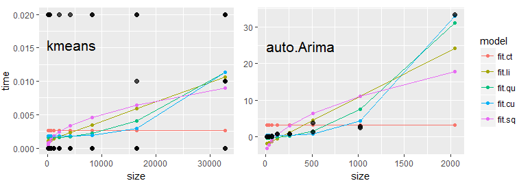

## Generalities

This project enables an R user to **estimate the computation time of a complex algorithm before fully running it**. 
The algorithm is run on an set of increasing-sizes **small portions of the data**. 
Various models are then fitted to capture the **computationnal efficiency trend** (independant o(1) , linear o(n) , quadratic o(n2), etc.) likely to best fit the algorithm;
The model eventually predicts the time for the full size of the data. 

More information on the subject of algorithmic time complexity on the [wikipedia page](http://en.wikipedia.org/wiki/Time_complexity). 

This project is composed of a single R script. This markdown acts as a help page for the function.
Running the script requires the following R packages (all available from the CRAN website)
*ggplot2, lubridate, boot*

## Details

The rationale under the estimation process is that computation time of an algorithm usually has a pretty constant behaviour with regard to data size: some are independant from the size (think of the `length` function), others need a time in cubic proportion of the number of rows. 
The `CompuTimeEstimate` function is fully configurable (see Arguments paragraph) and lets the user input the amount of time he has to run the estimation. The more time (usually 1 minute is enough) the more precise the estimation.
A significance test is added to alert the user when the model is not satisfactory enough. Replicates can be added at each point to make it more robust. 

The comparison between the models is achieved through a LOO (**leave-one-out**) routine: it withdraws each tested size one at a time from the model, and predicts on it. The best model on this criteria is choosen.
To avoid having too big a testing grid, the sample size grid is defined as a *geometric sequence of base 2* (which can be changed). The inconvenient of this practice is that the small samples might get a higher influence in the model. A future version shall correct this by adding weights.

The time complexity classes already implemented are the following:
*constant time, linear time, quadratic time, cubic time, fractional power*

## Arguments

| PACKAGE           | FONCTIONS                                                                          |
|-------------------|------------------------------------------------------------------------------------|
| whole.data        | the name of the data.frame used to estimate the time                               |
| custom.function   | the algorithm to be tested must be in the form of a function or a piping           |
| max.time          | Maximum time acceptable by the user for the audit of the complete algorithm.       |
| min.size          | The minimum size of the sampled data suggested to run properly the algorithm.      |
| sample.factor     | An option (not implemented yet) to sample according to a categorical variable.     |
| factor.col        | the column number for the sampling factor.                                         |
| base.sizes        | The multiplying factor used to determine the size of each successive iteration.    |
| plot              | Should there be a plot generated?                                                  |
| replicates        | How many replicates of each sampling size are made.                                |

## Examples

*try a quick algorithm*

expr = function(x) kmeans(x, centers=6)

CompuTimeEstimate(ggplot2::diamonds[, 1, 7:10], expr, plot=TRUE, replicates=10)

>[1] "Computation time is best fitted by a LINEAR model"

>[1] "Estimated computation time for the whole data: "

>[1] "0.05S"

*try a heavy algorithm (auto.arima), writing the custom function with the piping syntax*

library(dplyr)

expr = . %>% .$carat %>% ts(freq=24) %>% forecast::auto.arima(.)

CompuTimeEstimate(ggplot2::diamonds, expr, plot=TRUE, replicates=2, max.time=60)

>[1] "Computation time is best fitted by a CUBIC model"

>[1] "Estimated computation time for the whole data: "

>[1] "77d 11H 24M 51.5S"

## Licence

This code is under the GNU licence.

## Contributors

marc.agenis@gmail.com
